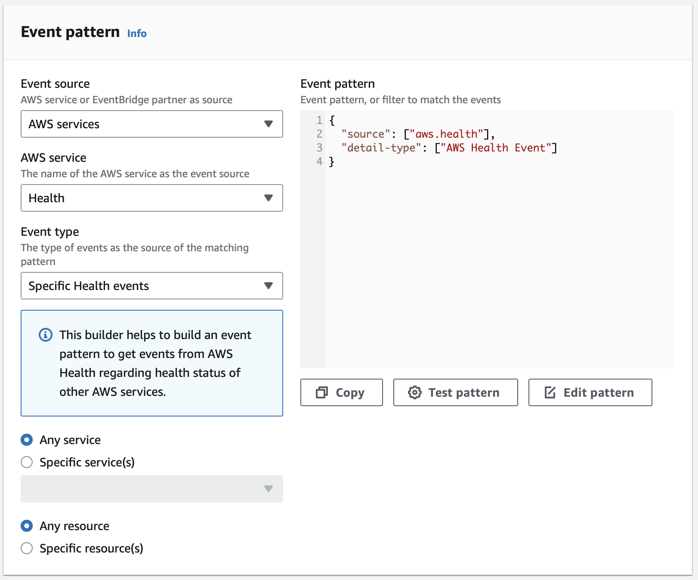

# Week 0 — Billing and Architecture

- [Week 0 — Billing and Architecture](#week-0--billing-and-architecture)
  - [Materials](#materials)
  - [Required Homeworks](#required-homeworks)
    - [1. Recreate Conceptual Diagram in Lucid Charts or on a Napkin](#1-recreate-conceptual-diagram-in-lucid-charts-or-on-a-napkin)
    - [2. Recreate Logical Architectual Diagram in Lucid Charts](#2-recreate-logical-architectual-diagram-in-lucid-charts)
    - [3. Create Admin user](#3-create-admin-user)
    - [4. Using AWS Cloud Shell](#4-using-aws-cloud-shell)
    - [5. Generate AWS credentials](#5-generate-aws-credentials)
    - [6. Install AWS CLI](#6-install-aws-cli)
    - [7. Create a budget, billing Alarm alerts](#7-create-a-budget-billing-alarm-alerts)
  - [Homework challenges](#homework-challenges)
    - [1. Destroy root account credentials, set MFA, IAM role](#1-destroy-root-account-credentials-set-mfa-iam-role)
    - [2. Use EventBridge to alert Health issues.](#2-use-eventbridge-to-alert-health-issues)
      - [What is an event?](#what-is-an-event)
      - [What is an Event-driven architecture?](#what-is-an-event-driven-architecture)
      - [What is the differences between EventBridge \& SQS](#what-is-the-differences-between-eventbridge--sqs)
      - [Send SNS when there is a service's health issue](#send-sns-when-there-is-a-services-health-issue)
        - [Prepare SNS topic](#prepare-sns-topic)
        - [Create Event rule in EventBridge](#create-event-rule-in-eventbridge)
    - [5. Research the technical and service limits of AWS Lambda](#5-research-the-technical-and-service-limits-of-aws-lambda)
      - [What is concurrent execution?](#what-is-concurrent-execution)
    - [6. Open a support ticket and request a service limit](#6-open-a-support-ticket-and-request-a-service-limit)


## Materials

- [x] Week 0 – Live Streamed Video Session
- [x] Week 0 – Chirag’s Spend Considerations
- [x] Week 0 – Ashish’s Security Considerations


## Required Homeworks
### 1. Recreate Conceptual Diagram in Lucid Charts or on a Napkin
- The C4 model: C4 = Context + Container + Component + Code. A way to `visualize` software architecture.
- Ok, here is my Napkin.


### 2. Recreate Logical Architectual Diagram in Lucid Charts

In this bootcamp, we will implement this architecture. I re-create it using LucidChart.
  - 

### 3. Create Admin user
- Go to IAM > Users > Create user
  - Choose [Enable console access], you should use console often.
  - Keep default for anything else
- Add user to a group
  - If you do not have a group yet, create one. Click [Create group]
  - Give it a name like `Administrator`
  - Add `AdministratorAccess` IAM policy to created group.
- Save your credential information at some where safe.
- Try to login into the console using that credential information
  - When first create, you will need to change your password (this setting can be enable/disable when you create the user)

### 4. Using AWS Cloud Shell
- Click on this icon to go to Cloud shell

- A warning like this will popped up to show that you do not have authorized for this service
  > Unable to start the environment. You don't have required permissions. Ask your IAM administrator for access to AWS CloudShell. System error: User: arn:aws:iam::*****:user/***** is not authorized to perform: cloudshell:CreateEnvironment on resource: arn:aws:cloudshell:us-east-1:*****:*
- Go to IAM > User groups > [Your user group]
- Add permission to your [User group] or user: `AWSCloudShellFullAccess`
  - I think that's not best practice to give *FullAccess anywhere, everytime but in this Cloud Bootcamp, we will use a lots of AWS Cloud shell, so just for future proof, add `AWSCloudShellFullAccess`
- Typing some command line to know your shell is working
  - When first create, the environment will show you a welcome popup.
  - In case you do not know how to use AWS CLI, [this reference](https://docs.aws.amazon.com/cli/latest/) from AWS will help.
    - Ex: aws s3 ls

### 5. Generate AWS credentials
- Go to IAM > Users > [Your user] > `Security credentals` tab > Create access key
- I create this key to access from my local code, so I choose `Local code`
- Set a tag
  
- Your scecret access key is only showed one, so you should **Download** it to .csv for later needs. If you loose this file, just go to IAM and create a new one.
  


### 6. Install AWS CLI
- Install AWS CLI on my local computer (MacOS)
```
curl "https://awscli.amazonaws.com/AWSCLIV2.pkg" -o "AWSCLIV2.pkg"
sudo installer -pkg AWSCLIV2.pkg -target /
```
- Check the AWS version
```
aws --version
aws-cli/2.9.23 Python/3.9.11 Darwin/22.3.0 exe/x86_64 prompt/off
```
- Go ahead, and configure my aws credential profile for this bootcamp (using the Access key and Secret access key retrieved at 5.). Set the --profile will help you switch between profile easier.
```
aws configure --profile bootcamp
AWS Access Key ID [None]: AIDAWIRQ******
AWS Secret Access Key [None]: tJBNH*******
Default region name [None]: ap-northeast-1
Default output format [None]: json
```

- Install AWS Toolkit extension for VSCode. This extension is offical from AWS
  
- After installing, click on the AWS label in the bottom of VSCode, you will see a Switch Connection popup asking you which profile to connect to.
  

### 7. Create a budget, billing Alarm alerts
- Go to your account (top right menu) > Billing Dashboard > Budgets
- Click `Create budget` button
- Choose Using a template
- Create 2 budgets for this bootcamp
  - one Zero spend budget, to inform that any service still running.
  - one Monthly cost budget to set my spending limitation. Mine is $100

- Create 1 custom budget for experimence
  - Choose [Customize] > [Usage budget]
  - Choose Create alert when using > 80% of the threshold
  - Ex: you set the usage budget is 2000 Hours for EC2 service, then 80% mean 1600 Hours


## Homework challenges
- [x] 1. Destroy your root account credentials, Set MFA, IAM role
- [x] 2. Use EventBridge to hookup Health Dashboard to SNS and send notification when there is a service health issue.
- [ ] 3. Review all the questions of each pillars in the Well Architected Tool (No specialized lens)
- [ ] 4. Create an architectural diagram (to the best of your ability) the CI/CD logical pipeline in Lucid Charts
- [x] 5. Research the technical and service limits of specific services and how they could impact the technical path for technical flexibility.
- [x] 6. Open a support ticket and request a service limit

### 1. Destroy root account credentials, set MFA, IAM role


To enable multi-factor authentication (MFA)
- Login with your root account
- Go to Security credentials > Multi-factor authentication > Assign MFA Device


- Set up the authenticator app on your device. You can use any authenticator app, such as: Google authentication, Microsoft authenticator,...I am using `Authy` because it allows multi-device.
- Press Show QR code
- Scan the QR code by your authenticator app
- Then fill 2 consecutive codes from the authenticator app
- Press [Add MFA]

Congratulation, you got your first Green check on the 1st security recommendations.

Secondly, do not create the access keys for root-account.
Try create some IAM user for this bootcamp

- Go to IAM > Users > Add user
- I do not add permissions to individual users, I add permissions to group of users. So that, after the bootcamp, I just need to remove the users from the group.


Finally, I check the 3rd security recommendations on the Dashboard.
- 
- So this announment means aws-portal:* policy will be `deprecated` from July 2023.
  - The fine-grained actions launch enables customers to provide individuals in their organization access to only services that are necessary for their job. For example, with these new permissions a customer can provide a developer access to Budgets and Cost Explorer, while denying access to Bills or Tax Settings services
- I go to IAM > Policies to see what went wrong? So I really have a customer managed policy that grant all the billing authentications.
  
- Because I just create this policy for testing customer-managed policy, I will delete it.

Ok. So I do all the recommendations.

### 2. Use EventBridge to alert Health issues.

EventBridge is a `serverless` service for building `event-driven` applications using events from your applications integrated SaaS applications.

#### What is an event?
- Event is a `record of action`
- Represented as JSON object:
  - Data from the event
  - Meta data about the event


#### What is an Event-driven architecture?
Event-driven architectures are an architecture style that can help you boost agility and build reliable, scalable applications.

Serverless services like EventBridge, Step Functions, SQS, SNS, and Lambda have a natural affinity with event-driven architectures - they are invoked by events, emit events, and have built-in capabilities for building with events.

[learn more about Event-driven](https://serverlessland.com)

#### What is the differences between EventBridge & SQS

|**EventBridge**|**SQS**|
|:---|:---|
|process **one** at a time| process in **batches**|
|match multiple rules & send to multiple target|event no longer available after successful processing|

#### Send SNS when there is a service's health issue
We will create this pattern.


##### Prepare SNS topic
- Go to Amazon SNS > Topics > Create topic
- We do not care about the ordering of the messages, so just use standard topic
  
- Click [Create topic]


##### Create Event rule in EventBridge
- Go to Amazon EventBridge > Rules > Create rule
- I am using the default Event bus, type: rule with event pattern (not scheduler)
- In Sample events, choose [AWS Health Event]
  
- Under **Event pattern**, for **Event source**, choose **AWS services**.
- Under **Event pattern**, for **AWS service**, choose **Health**. Click [Next]
  
- Select SNS as the target > Next > Create rule
  


Congratulation! We successfully created a EventBridge rule that will send notification when a service's health go wrong.


### 5. Research the technical and service limits of AWS Lambda
AWS Lambda can not used in any case below:
- Process time >= 15min (900s)
- Memory >=10GB
- GPU needed
- Statefull process

This will impact the technical path and technical flexibility. For example, if you have a batch that has processing time more than 900 seconds, it's better to use another services, or run the batch traditional way on an EC2.

Lambda also has a default limit of 1,000 concurrent executions by region. Refer [Lambda quotas](https://docs.aws.amazon.com/lambda/latest/dg/gettingstarted-limits.html) for more limit information. But this can increase to 10,000.

#### What is concurrent execution?
The number of request that your Lambda function handle at the SAME time.


### 6. Open a support ticket and request a service limit
To increase the concurrent executions by region of AWS Lambda. I will [request a quotas increase](https://docs.aws.amazon.com/servicequotas/latest/userguide/request-quota-increase.html). A little suprise that there are other way to request a service limit beside by opening ticket in AWS Console. You can
- Using the AWS Manage Console
- Using AWS CLI or SDK operations

To be more simple, I will use the Console for this homework.
- Open Service Quotas console at https://console.aws.amazon.com/servicequotas/home
- Choose 
- Chose Concurrent executions > [Request quotas increase]
  
- I will request to increase the quotas for this to 1500. Click [Request]
- Check the request by viewing [Quota request history]
  