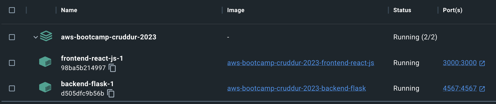
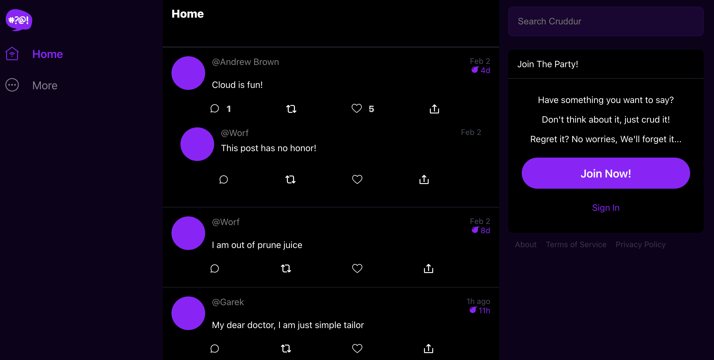
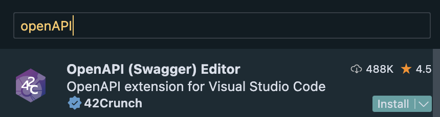
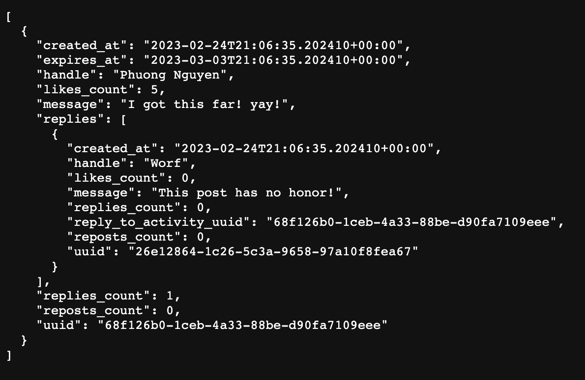
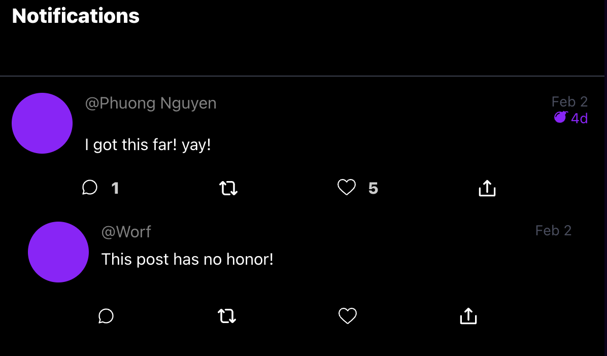
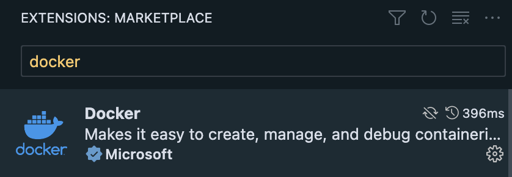
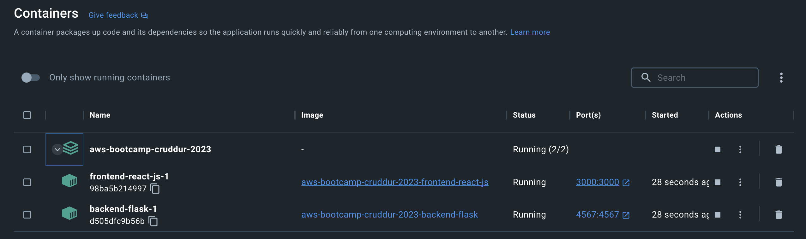

# Week 1 — App Containerization

- [Week 1 — App Containerization](#week-1--app-containerization)
  - [Prerequisite Knowledge](#prerequisite-knowledge)
  - [Materials](#materials)
  - [More materials](#more-materials)
  - [Required Homeworks](#required-homeworks)
    - [1. Containerize Application (Dockerfiles, Docker Compose)](#1-containerize-application-dockerfiles-docker-compose)
      - [1-1. Fix encoding error in Dockerfile](#1-1-fix-encoding-error-in-dockerfile)
      - [1-2. Fix CORS error](#1-2-fix-cors-error)
      - [1-3. Run the CRUDDUR app](#1-3-run-the-cruddur-app)
    - [2. Document the Notification Endpoint for the OpenAI Document](#2-document-the-notification-endpoint-for-the-openai-document)
    - [3. Write a Flask Backend Endpoint for Notifications](#3-write-a-flask-backend-endpoint-for-notifications)
    - [4. Write a React Page for Notifications](#4-write-a-react-page-for-notifications)
    - [5. Run DynamoDB Local Container and ensure it works](#5-run-dynamodb-local-container-and-ensure-it-works)
    - [6. Run Postgres Container and ensure it works](#6-run-postgres-container-and-ensure-it-works)
  - [Homework Challenges](#homework-challenges)
    - [1. Learn how to install Docker on your localmachine and get the same containers running outside of Gitpod / Codespaces](#1-learn-how-to-install-docker-on-your-localmachine-and-get-the-same-containers-running-outside-of-gitpod--codespaces)

## Prerequisite Knowledge

- [x] [Docker in 5 minutes](https://www.youtube.com/watch?v=cxCG0cFgsd4): the shortest and easiest way to get to know Docker
- [ ] [Adrian Cantrill – Docker Fundamentals (Free)](https://learn.cantrill.io/p/docker-fundamentals)
- [ ] [Docker Labs for absolute beginner (Free)](https://kodekloud.com/topic/labs-basic-docker-commands-beta/): the playground to play with Docker @ kodekloud
- [x] [Everything You Need to Know About OpenAPI 3.0 - Erin McKean](https://www.youtube.com/watch?v=NFI5GTBEb0k): under 10 minutes video form #LeadDev to talk about Swagger -> OpenAPI3.0

## Materials

- [x] Grading Homework Summaries
- [x] Week 1 - Live Streamed Video
- [x] Chirag's Week 1 - Spending Considerations
- [x] Ashish's Week 1 - Container Security Considerations

## More materials

- [ ] [Docker best practices for Python Developer](https://testdriven.io/blog/docker-best-practices/)

## Required Homeworks
- [x] 1. Containerize Application (Dockerfiles, Docker Compose)
- [x] 2. Document the Notification Endpoint for the OpenAPI Document
- [x] 3. Write a Flask Backend Endpoint for Notifications
- [x] 4. Write a React Page for Notifications
- [ ] 5. Run DynamoDB Local Container and ensure it works
- [ ] 6. Run Postgres Container and ensure it works

### 1. Containerize Application (Dockerfiles, Docker Compose)
These are the containers after containerize the application


#### 1-1. Fix encoding error in Dockerfile
When I view container's log, the log's encoding is broken
<details>
<summary>Log</summary>

```
 * Debugger is active!
 * Debugger PIN: 601-658-487
172.22.0.1 - - [25/Feb/2023 06:54:06] code 400, message Bad request version ('u°\x9c8#\x93A;s')
172.22.0.1 - - [25/Feb/2023 06:54:06] "üa¯B1ë~ª.Ý:R
õÿýOj®¡´å©s ã´ã- {N
n*Cu°8#A;s" HTTPStatus.BAD_REQUEST -
172.22.0.1 - - [25/Feb/2023 06:54:06] code 400, message Bad request version ('localhost\x00\x17\x00\x00ÿ\x01\x00\x01\x00\x00')
172.22.0.1 - - [25/Feb/2023 06:54:06] "ü)!¿@qUçiÎÕe¤rl`³5ç­Y¤ô uHò ýãé(ø1[¾Z'¾­½{-ÞÎ
                 ,"úúÀ+À/À,À0̨̩ÀÀ
                                        localhostÿ" HTTPStatus.BAD_REQUEST -
```

</details>

<details>
<summary>Fix</summary>


</details>


#### 1-2. Fix CORS error
in `appy.py` replace
```js
 resources={r"/api/*": {"origins": "origins"}},
```
with this
```js
 resources={r"/api/*": {"origins": "*"}},
```

#### 1-3. Run the CRUDDUR app
Finally, complete integrate the backend to the frontend. Woohoo <3


### 2. Document the Notification Endpoint for the OpenAI Document
- Install the OpenAPI extension to VSCode
  
- Refer /api/activities to add the api/activities/notifications to .yml file.

### 3. Write a Flask Backend Endpoint for Notifications

- Open app.py and add new api/activities/notifications end-point
```python
@app.route("/api/activities/notifications", methods=['GET'])
def data_notification():
  data = NotificationActivities.run()
  return data, 200
```
- Add `notification_activities.py` by cloning from home_activities.py
- Check backend endpoint: http://localhost:4567/api/activities/notifications



### 4. Write a React Page for Notifications
- I do not know React, so I will study the src code a little bit. So the entrance (frontend endpoint) is `index.js`.
- In index.js, it load ./App, so React use App.js as a Router. Let add 1 more route
```js
  {
    path: "/notifications",
    element: <NotificationFeedPage />
  },
```
- Let create `NotificationFeedPage` cloning from `HomeFeedPage`. Let see if it work?


Too good to be true. Let's commit the code.

### 5. Run DynamoDB Local Container and ensure it works

### 6. Run Postgres Container and ensure it works

## Homework Challenges
### 1. Learn how to install Docker on your localmachine and get the same containers running outside of Gitpod / Codespaces
My local machine is MacOS. I used homebrew to install Docker desktop.
```
brew install docker
```
Then, install the Docker extension in VSCode


After config the links in docker-compose.yml to local links, I got all the containers running like this.


Here is my configured docker-compose.yml
```yml
version: "3.8"
services:
  backend-flask:
    environment:
      FRONTEND_URL: "http://localhost:3000/"
      BACKEND_URL: "http://localhost:4567/"
      OTEL_EXPORTER_OTLP_ENDPOINT: "https://api.honeycomb.io"
      OTEL_EXPORTER_OTLP_HEADERS: "x-honeycomb-team=${HONEYCOMB_API_KEY}"
      OTEL_SERVICE_NAME: "${HONEYCOMB_SERVICE_NAME}"
    build: ./backend-flask
    ports:
      - "4567:4567"
    volumes:
      - ./backend-flask:/backend-flask
  frontend-react-js:
    environment:
      REACT_APP_BACKEND_URL: "http://localhost:4567"
    build: ./frontend-react-js
    ports:
      - "3000:3000"
    volumes:
      - ./frontend-react-js:/frontend-react-js

# the name flag is a hack to change the default prepend folder
# name when outputting the image names
networks:
  internal-network:
    driver: bridge
    name: cruddur
```